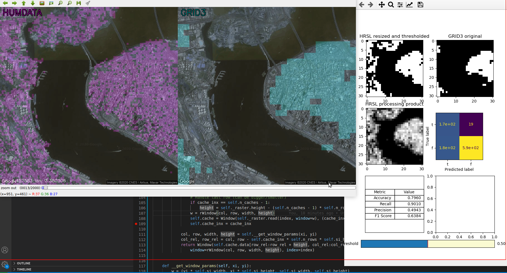
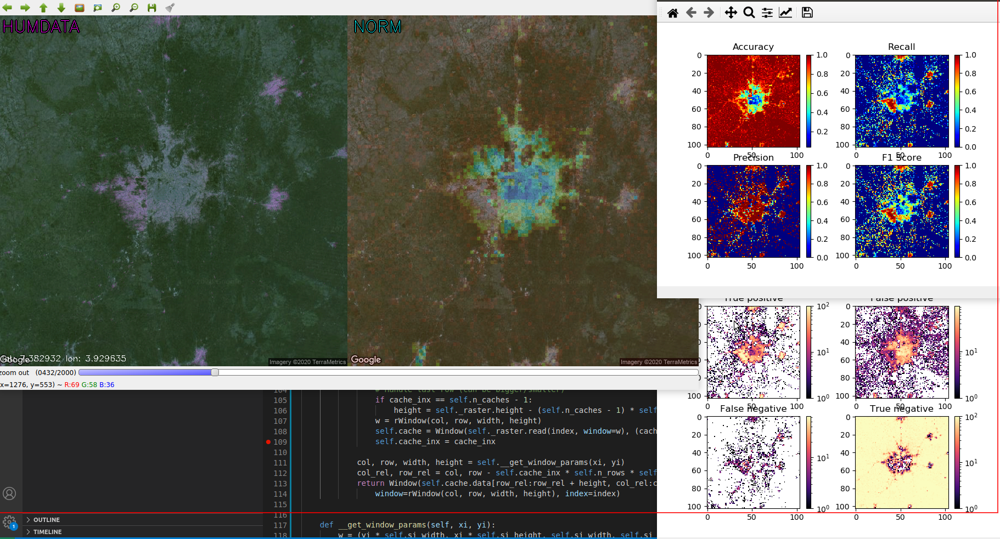

# Assessing biases in AI generated human settlement data from high-resolution satellite imagery

## Description
Accurately identifying and mapping inhabited areas, and deriving human settlement maps therefrom, is critical for humanitarian operations. Recent advances in artificial intelligence and price drops in the cost of high-resolution satellite imagery have opened possibilities for deriving detailed populations maps from satellite imagery using deep learning frameworks. 
However, while current AI and machine learning algorithms are known to produce satisfactory results in classifying well known patterns of settlement areas, it is still a huge challenge to accurately identify  human settlement patterns in rural and remote areas, and for developing countries where the most vulnerable populations live.

## Research problem and methods
This study aims at assessing biases in recently released population settlement datasets from Facebook. Specifically, at investigating to which extent the accuracy of the model depends on the socio-economic and developmental indicators of an area.
Due to the novelty of the datasets, this is an understudied topic. As such, there exists no agreed upon methodology. However, a few academic papers are closely related to the field of study, e.g. ‘A hierarchical Bayesian modeling framework to account for uncertainty’ and ‘Mapping the world population one building at a time’. We will draw inspiration from these.

## Results
Input data are visualized at any detail level. The tool shows two datasets aligned with google maps satellite imagery, on the picture below part of Lagos, the Nigeria's capital. The left-hand side (magenta color) shows high resolution settlement layer, i.e. High resolution population density maps, and the right-hand side (blue color) presents GRID3 (National Population Estimates). Other plots depict products of computation pipeline and allow to interact with it by changing parameters.<br>
The results attempts to meassure a relative accuracy of the HRSL with respect to the GRID3, that is, evaluate classification results of HRSL as if GRID3 was ground truth labeled data.


The application allows to evaluate and visualize results and computation products (spatially distributed metrics) at any location and detail level (zoom). The picture below presents Ibadan (southern part of Nigeria). On the left-hand side the high resolution population layer and on the right-hand side the accuracy distributed spatially. Other plots refer to the same region and visualize different measurements.



# Init environment

```bash
# Create:
conda env create --file environment.yml
# Update (after someone else has changed):
conda env update --file environment.yml
```

Set the `PYTHONPATH` to the repo (module setup):
```bash
export PYTHONPATH="$PYTHONPATH:<location-of-project>/ResearchProjectAutumn2020/src:<location-of-project>/ResearchProjectAutumn2020:<location-of-project>/ResearchProjectAutumn2020/test"
```

# Tests
All tests are located in `test` subdirectory of this project. You can run all suites from `test/runner.py` or single test case from specified test file, e.g. `test/utils/location.py`.
```bash
# In humset conda env
# All suites:
python test/runner.py
# A single test case for a module, e.g.:
python -m unittest test/utils/location.py
```

# Data

Humdata: https://data.humdata.org/dataset/highresolutionpopulationdensitymaps-nga <br>
Worldpop: ftp://ftp.worldpop.org.uk/GIS/Population/Global_2000_2020/2018/NGA/ <br>
GRID3: https://s3-eu-west-1.amazonaws.com/files.grid3.gov.ng/pop/GRID3+-+NGA+-+National+Population+Data+-+v1.2.zip

# Report

To work on the report in *overleaf*, zip the report directory, then in *overleaf* do 
New Project -> Upload Project and select report.zip.

To work on the report locally, you can install the needed tools on Ubuntu by running
```bash
apt install texlive
```
Advised: create separate directory for latex output in the parent of report
```bash
# cwd = report
mkdir ../out
```
To generate pdf run
```bash
# cwd = report
pdflatex --output-directory ../out/ report
```
If references have changed, also need to run
```bash
biber --input-directory ../out/ --output-directory ../out/ report
```
Put all the images in report/images.